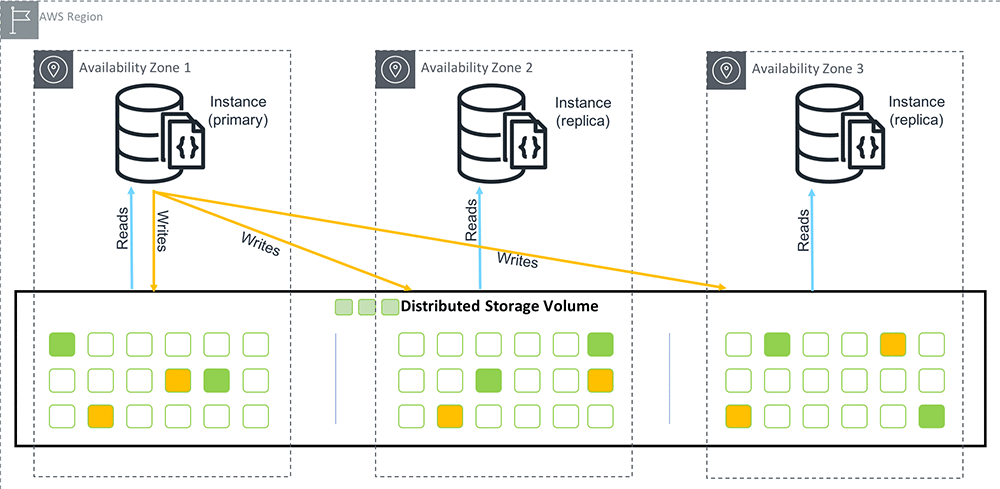

# Big Data project - associating photos of planes with planes

Group 6:
- Joseph CASCIO
- Vincent DELY
- Lisa DUTERTE
- Maxime PERONA

## What is the project?

The goal of this project is to develop a system that can take an input photo of a plane and output the specific plane depicted in the photo at a given time.

To achieve this goal, the project uses metadata associated with photos of planes to match the specific plane depicted in the photo. This is done through an extract, transform, load (ETL) process that compares the metadata of the photos and stores the matching results in a key-value database.

Our mission was to retrieve data from a datalake that is storing the photos' metadata and store them in a MongoDB cluster with replication enabled to ensure data resilience. We also had to deliver this data to the ETL process on demand.

## The project's architecture

### The MongoDB cluster

We came with the idea to setup and to provide a MongoDB cluster composed of 3 nodes with replication enabled, using the AWS platform.

The `terraform` folder contains deployment files that deploy our MongoDB cluster on AWS Cloud automatically. In the following image, you can observe the health state of our cluster we managed to deploy during this project.

The `docker-compose.yaml` file describes our configurations for a local MongoDB cluster. Use the `rs-init.sh` script to enable replication on this cluster by executing it inside the primary node (it will be already present at the path `/scripts/rs-init.sh`).

> During our demonstration, we used a single local MongoDB container due to lack of time for setting up and interacting with both our AWS and local clusters.

### Deliver data on demand with an API

In the `src` folder, you can find our codebase for our REST API. The `models` folder contains our data model for storing this metadata (timestamp, latitude, longitude). The `routes` folder contains all the routes that we expose when we execute and make available our API. You can get all data, get data on a specific timestamp and also insert data thanks to a specific POST route that we also used during the demonstration to insert generated metadata thanks to our script.

### Generate metadata to test the database and the API

The `generate_metadata.py` script generates metadata (timestamp and position) of 2 planes - moving randomly around previous position in a customizable range - and inserts it into our cluster every 0.4 second.